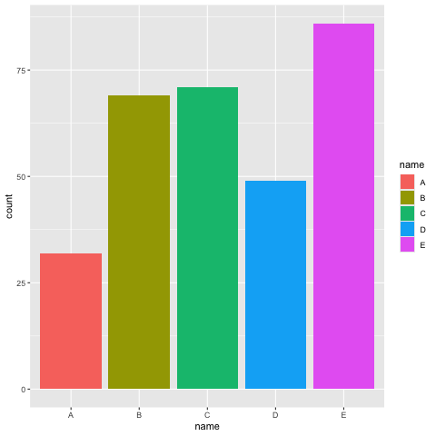
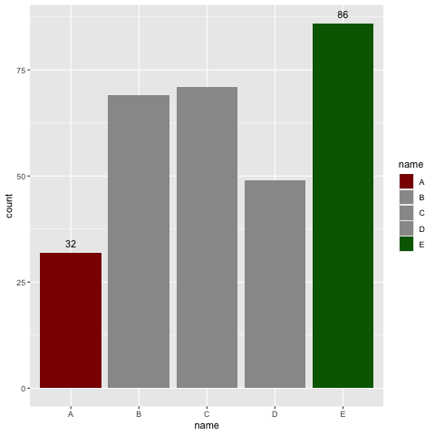
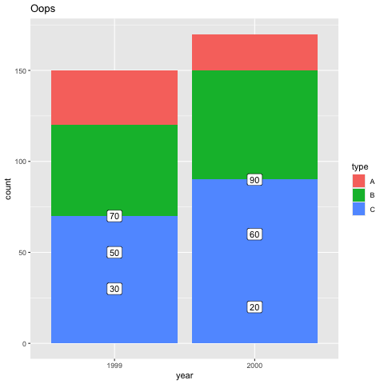
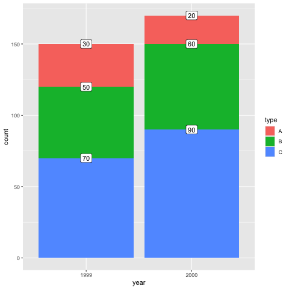
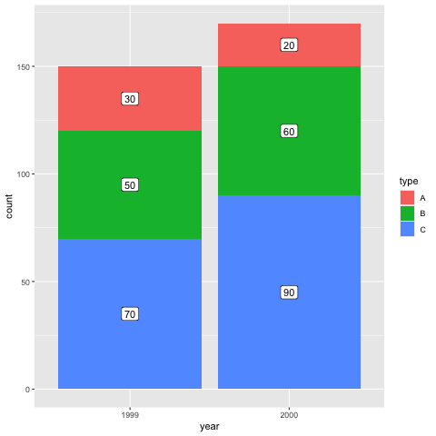
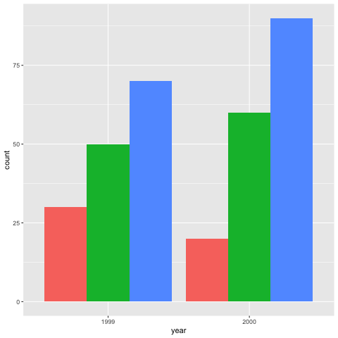
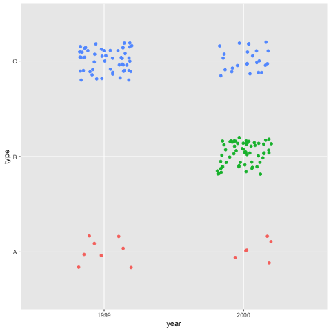
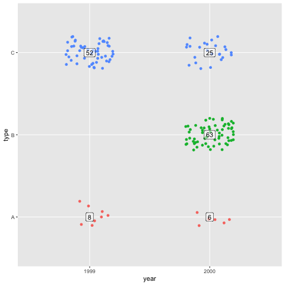
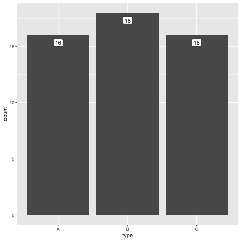

#+title: An imperfect cookbook on ggplot
#+PROPERTY: header-args :session *r-notes* :exports both :results value verbatim
#+HTML_HEAD: <link rel="stylesheet" href="minimal.css" type="text/css"/>
#+EXPORT_FILE_NAME: index
#+OPTIONS: toc:nil

These notes began as personal "recipes" for doing simple things with
ggplot in R. When I started preparing them to be shared, I realised they
included some subpar advice.

After the first note turned into a post about how not to do things
([[id:stacked-bar-chart][Positioning labels on a stacked bar chart]], see below), I changed my
approach. Rather than aiming for "best practice," these notes now
reflect my own learning process in R.

I’m sharing them in the hope that other (especially
beginner-to-intermediate) R users might learn from them. So please
take them for what they are: scribbles on my own exploration of how
(not) to do things in R.

#+TOC: headlines 2

* Bar chart highlighted lowest and highest bars
** Bar chart with colours

A bar graph that highlights the highest & lowest values? We can use
=scale_fill_manual()= for colours and add labels to the same bars.

First, some data.

#+begin_src R :results table :colnames yes
library("tidyverse")
library("ggplot2")

df <- data.frame(name =  c("A", "B", "C", "D", "E"),
                 count = sample(20:100, size = 5))
#+end_src

#+RESULTS:
| name | count |
|------+-------|
| A    |    46 |
| B    |    91 |
| C    |    73 |
| D    |    23 |
| E    |    68 |

The base bar chart is pretty straightforward. 

Note that we already map a =fill= in the =aes()= definition, even
though it is not the colour we want. However, it's crucial to make
this mapping, so that =scale_fill_manual()= can override it later.

#+begin_src R :results graphics file :file img/bar-hi-1.png
g <- ggplot(df, aes(x = name, y = count, fill = name)) +
  geom_col()
g
#+end_src

#+RESULTS:

To add colours to only the highest and lowest values of the bar chart,
we can create a separate vector.

#+begin_src R
colour_palette <- case_when(df$count == min(df$count) ~ "darkred",
                            df$count == max(df$count) ~ "darkgreen",
                            TRUE ~ "gray60")
colour_palette
#+end_src

#+RESULTS:
: gray60
: darkgreen
: gray60
: darkred
: gray60

This vector lists the colours we need to fill the bars with. We can
now apply this to alter the filling of the bars, like so:

#+begin_src R :results graphics file :exports both :file img/bar-hi-2.png
g +
  scale_fill_manual(values = colour_palette)
#+end_src

#+RESULTS:

That's all there is to it! It's obviously trivial to alter the
=case_when()= triage to create different custom colour palette.

** Adding labels

To add labels to these bars, we can create a new variable in our
dataframe.

#+begin_src R :results table :colnames yes
df <- df |>
  mutate(label = case_when(count == min(df$count) ~ count,
                           count == max(df$count) ~ count))
#+end_src

#+RESULTS:
| name | count | label |
|------+-------+-------|
| A    |    46 |       |
| B    |    91 |    91 |
| C    |    73 |       |
| D    |    23 |    23 |
| E    |    68 |       |

Next, we add =geom_text()= layer to our graph.
Our full graph then becomes:

#+begin_src R :results graphics file :exports both :file img/bar-hi-3.png
ggplot(df, aes(x = name, y = count, fill = name, label = label)) +
  geom_col() +
  geom_text(vjust = -.8) +
  scale_fill_manual(values = colour_palette)
#+end_src

#+RESULTS:

* Positioning labels on a stacked bar chart
:PROPERTIES:
:CUSTOM_ID: stacked-bar-chart
:END:

How to create a stacked bar chart with correctly positioned labels.
Or: creating the same plot twice.

Let's start with some dummy data in long form.

#+begin_src R :results table :colnames yes
library("tidyverse")
library("ggplot2")

df <- data.frame(year  = c("2000", "2000", "2000",
                           "1999", "1999", "1999"),
                 type  = c("A", "B", "C",
                           "A", "B", "C"),
                 count = c(20,  60,  90,
                           30,  50, 70))
#+end_src

#+RESULTS:
| year | type | count |
|------+------+-------|
| 2000 | A    |    20 |
| 2000 | B    |    60 |
| 2000 | C    |    90 |
| 1999 | A    |    30 |
| 1999 | B    |    50 |
| 1999 | C    |    70 |

In a normal stacked bar chart, labels will not be positioned correctly:

#+begin_src R :results graphics file :file img/bar-chart-1.png
g <- ggplot(df, aes(x = year, y = count)) +
  geom_col(aes(fill = type))

g +
  geom_label(aes(label = count)) +
  labs(title = "Oops")
#+end_src

#+RESULTS:

The reason is pretty obvious, as =geom_label()= uses =count= as
y-value rather than stacking the labels.

To fix this, we can calculate y-values separately.

Let's add a column to the data frame, like so:
 1. ensure the data is grouped by x-axis, so that you calculate for
    each bar of the bar chart,
 2. sort your date by both x-axis and fill grouping,
 3. calculate the middle height of each block as =cumsum(count) -
    count /2=.

#+begin_src R :results table :colnames yes
df2 <- df |>
  group_by(year) |>
  arrange(year, desc(type)) |>
  mutate(label_y = cumsum(count) - count/2)
df2
#+end_src

#+RESULTS:
| year | type | count | label_y |
|------+------+-------+---------|
| 1999 | C    |    70 |      35 |
| 1999 | B    |    50 |      95 |
| 1999 | A    |    30 |     135 |
| 2000 | C    |    90 |      45 |
| 2000 | B    |    60 |     120 |
| 2000 | A    |    20 |     160 |

This now plots nicely when we use the calculated y-values in the
=aes()= of =geom_label()=.

#+begin_src R :results graphics file :file img/bar-chart-2.png
g2 <- ggplot(df2, aes(x = year, y = count)) +
  geom_col(aes(fill = type))

g2 +
  geom_label(aes(label = count, y = label_y))
#+end_src

#+RESULTS:
[[file:img/bar-chart-2.png]]

** But wait... What about =position_stack()=
:PROPERTIES:
:UNNUMBERED: t
:END:

Oh no, I just found out there's an even easier way to do this, by
giving =position= instructions to the =geom_label()=. It recognises
="stack"= as instruction.

#+begin_src R :results graphics file :file img/bar-chart-3.png
g3 <- ggplot(df, aes(x = year, y = count, group = type)) +
  geom_col(aes(fill = type))

g3 +
  geom_label(aes(label = count), position = "stack")
#+end_src

#+RESULTS:

Note that we need to include =aes(group = )=, it ensures the groups
are stacked correctly (i.e. corresponding with the =fill=
instruction).

This positions the labels at the top of each stack, which doesn't look
appealing, but we can set position also with a function:
=position_stack()=, where =vjust = .5= centers the labels vertically.

#+begin_src R :results graphics file :file img/bar-chart-4.png
g3 + 
  geom_label(aes(label = count),
             position = position_stack(vjust = .5))
#+end_src

#+RESULTS:

** So let's also learn about =position_dodge()=
:PROPERTIES:
:UNNUMBERED: t
:END:

To switch from a stacked bar plot to a multi bar plot, adjust
=position= to ="dodge"=.

#+begin_src R :results graphics file :file img/bar-chart-5.png
g4 <- ggplot(df, aes(x = year, y = count, group = type)) +
  geom_col(aes(fill = type), position = "dodge", show.legend = F)
g4
#+end_src

#+RESULTS:

To add, labels don't forget to adjust =position= in the =geom_label()=.
Adjust width value to the default column widths.

#+begin_src R :results graphics file :file img/bar-chart-6.png
g4 +
  geom_label(aes(label = count),
             position = position_dodge(width = .9))
#+end_src

#+RESULTS:

* From summarized counts to a jittered dotplot

It's sometimes nice to have a graph where each dot represents an
observation. That's where =geom_point()= and especially
=geom_jitter()= shine. But how can we one dot per obseration when we
start from summarized data?

Let's start with some dummy data.

#+begin_src R :results table :colnames yes
library(tidyverse)
library(ggplot2)

# example data
df <- data.frame(year  = c("2000", "2000", "2000",
                           "1999", "1999", "1999"),
                 type  = c("A", "B", "C",
                           "A", "B", "C"),
                 n = c(6,  63,  25,
                       8,  NA,  52))
#+end_src

#+RESULTS:
| year | type |  n |
|------+------+----|
| 2000 | A    |  6 |
| 2000 | B    | 63 |
| 2000 | C    | 25 |
| 1999 | A    |  8 |
| 1999 | B    |    |
| 1999 | C    | 52 |

Our data already is in long format, but with summarized counts. To
transform it into one row per observation (i.e., a single row for each
count), we can use =uncount()=.

Note that for =uncount()= to work, we need to filter out any =NA=
values.

#+begin_src R :results table :colnames yes
dfu <- df |>
  filter(!is.na(n)) |>
  uncount(n, .id = "nr")

head(dfu, 10)
#+end_src

#+RESULTS:
| year | type | nr |
|------+------+----|
| 2000 | A    |  1 |
| 2000 | A    |  2 |
| 2000 | A    |  3 |
| 2000 | A    |  4 |
| 2000 | A    |  5 |
| 2000 | A    |  6 |
| 2000 | B    |  1 |
| 2000 | B    |  2 |
| 2000 | B    |  3 |
| 2000 | B    |  4 |

This data frame, with one row per observation, can now be used in a ggplot.

#+begin_src R :results graphics file :exports both :file img/count-to-jitter-1.png
g <- ggplot(dfu, aes(x = year, y = type)) +
  geom_jitter(aes(colour = type), show.legend = FALSE,
              width = .2, height = .2)

g
#+end_src

#+RESULTS:

If we want to include a summarised total of counts per category, we
need to add labels from the summarised data frame by setting =data =
df= in =geom_label()=.

#+begin_src R :results graphics file :exports both :file img/count-to-jitter-2.png
g + geom_label(data = df, aes(label = n),
               alpha = .5, show.legend = FALSE)
#+end_src

#+RESULTS:

* Using =after_stat()= to add labels to a bar chart

Once again, we need some dummy data first. Let's whip up a dataframe
with 50 observations of one variable.

#+begin_src R :results output
library(tidyverse)
library(ggplot2)

df <- data.frame(type = sample(c("A", "B", "C"),
                               size = 50, replace = TRUE))
df$type <- factor(df$type)

str(df)
summary(df)
#+end_src

#+RESULTS:
: 'data.frame':	50 obs. of  1 variable:
:  $ type: Factor w/ 3 levels "A","B","C": 1 1 2 1 1 3 2 1 2 2 ...
:  type  
:  A:16  
:  B:18  
:  C:16

When =ggplot= draws a plot, it calculates different values.
=geom_bar()= for example, only requires either =x= or =y= values and
will compute the other to draw the graph. These calculated statistics
can be accessed later.

Let's start with a simple bar chart.

#+begin_src R :results graphics file :file img/bar-simple-1.png
p <- ggplot(df, aes(x = type)) +
  geom_bar()

p
#+end_src

#+RESULTS:

To get an idea of what ggplot computes, we can take a look at the data
in the object it creates. Below, =i = 1= indicates we want to look at
the first layer.

(Note that the =options()= line is only there so that the line width of
the output is long enough.)

#+begin_src R :results output
options(width = 200)
layer_data(p, i = 1)
#+end_src

#+RESULTS:
:   count prop x flipped_aes PANEL group  y ymin ymax xmin xmax colour      fill linewidth linetype alpha width
: 1    16    1 1       FALSE     1     1 16    0   16 0.55 1.45     NA #595959FF       0.5        1    NA   0.9
: 2    18    1 2       FALSE     1     2 18    0   18 1.55 2.45     NA #595959FF       0.5        1    NA   0.9
: 3    16    1 3       FALSE     1     3 16    0   16 2.55 3.45     NA #595959FF       0.5        1    NA   0.9

So the =ggplot= object we created, has a variable called =count=, and
that =y= has the same value.

We want to add labels with the values of =count=. To access these
values, we can use =after_stat()=, which allows the mapping of the
values to be delayed until after =count= has been calculated. So in
the =aes()=, we set =label = after_stat(count)=.

Note that we also need to set =stat = "count"=, to change the
statistical transformation the layer uses.

#+begin_src R :results graphics file :file img/bar-simple-2.png
q <- p +
  geom_label(aes(label = after_stat(count)),
             stat = "count", vjust = 1.5)
q
#+end_src

#+RESULTS:

Let's take a look at the layer we just added.

#+begin_src R :results output
options(width = 200)
layer_data(q, i = 2)
#+end_src

#+RESULTS:
:   count prop x width flipped_aes PANEL group label  y nudge_x nudge_y colour  fill family     size angle hjust vjust alpha fontface lineheight linewidth linetype
: 1    16    1 1   0.9       FALSE     1     1    16 16       0       0  black white        3.866058     0   0.5   1.5    NA        1        1.2      0.25        1
: 2    18    1 2   0.9       FALSE     1     2    18 18       0       0  black white        3.866058     0   0.5   1.5    NA        1        1.2      0.25        1
: 3    16    1 3   0.9       FALSE     1     3    16 16       0       0  black white        3.866058     0   0.5   1.5    NA        1        1.2      0.25        1

And we can see the =label= values have been added.

For more detailed information on =after_stat()=, see
https://yjunechoe.github.io/posts/2022-03-10-ggplot2-delayed-aes-1/.

* COMMENT Local variables

# Local Variables:
# org-export-use-babel: nil
# org-html-htmlize-output-type: css
# End:
